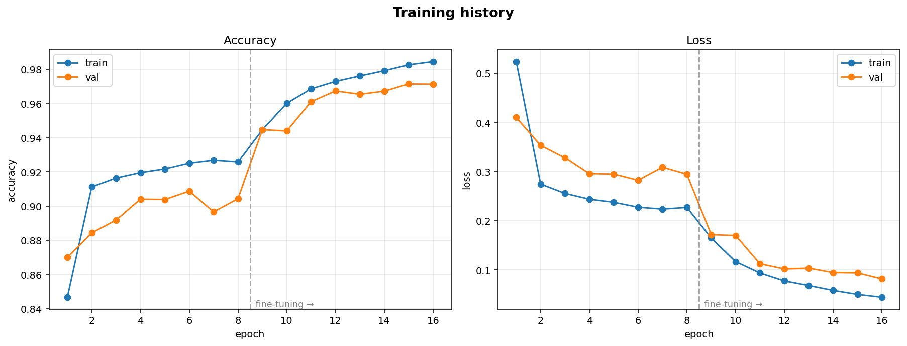
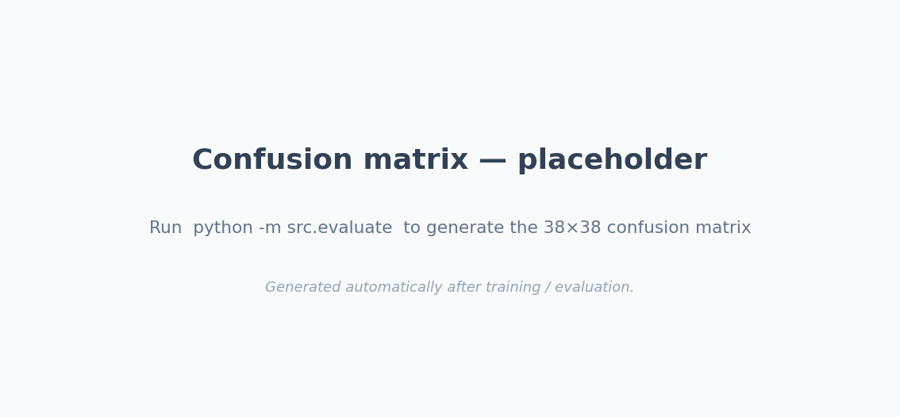

# 🌿 Plant Leaf Disease Classifier

Deep-learning system that identifies **38 crop-disease classes** from a single leaf photo, built with transfer learning on the [New Plant Diseases Dataset](https://www.kaggle.com/datasets/vipoooool/new-plant-diseases-dataset) (~87,900 images). It ships with a two-phase training pipeline, held-out test evaluation, **Grad-CAM explainability**, and a Dockerised **Streamlit** demo that shows *why* the model made each call.

<p align="left">
  
  
  
  
  
</p>

---

## Why this project stands out

Most versions of this project stop at "train a CNN, print accuracy." This one is built the way a small production ML project would be:

- **Baseline → transfer → fine-tune.** A from-scratch CNN establishes a baseline, then MobileNetV2 / ResNet50 / EfficientNetB0 backbones are benchmarked against it — so the accuracy gains are *earned and measured*, not assumed.
- **Two-phase transfer learning** — feature extraction with a frozen backbone, then fine-tuning the top layers with a very low learning rate (BatchNorm kept frozen, the way it should be).
- **Grad-CAM explainability** — every prediction comes with a heatmap over the leaf, so you can verify the model looks at the *lesion*, not the background. This is the single biggest talking point in an interview.
- **Honest evaluation** — the official `valid` set is split into a validation set (for early stopping / model selection) and a **held-out test set** that is *only* touched for the final reported metrics.
- **Preprocessing baked into the model graph** — the saved `.keras` model accepts raw pixels and normalises internally, eliminating the classic "works in the notebook, wrong in the app" bug.
- **Clean, importable `src/` package + CLI + config** — not a single 800-cell notebook. Reproducible seeds, pinned deps, and a `Makefile`.
- **Deployable** — Dockerfile + a slim CPU requirements file for Streamlit Community Cloud.

---

## Demo

```bash
streamlit run app/app.py
```

Upload a leaf → get the diagnosis, confidence, top-3 alternatives, and a Grad-CAM attention map side-by-side.

> The app reads `models/plant_disease_model.keras`. Train the model first (below) and the demo lights up.

---

## Results

Metrics are computed on the **held-out test split** and written to [`models/metrics.json`](models/metrics.json) by `python -m src.evaluate`. Fill this table in from your own run:

| Model | Params | Test accuracy | Macro-F1 | Top-3 accuracy |
|-------|-------:|--------------:|---------:|---------------:|
| CNN (from scratch) | ~0.5 M | — | — | — |
| **MobileNetV2** (fine-tuned) | ~2.6 M | 98.24% | 0.9821 | 99.91% |
| ResNet50 (fine-tuned) | ~24 M | — | — | — |

> On this benchmark, fine-tuned lightweight backbones like MobileNetV2 commonly reach **~98–99% test accuracy** — treat that as the target your run should approach, and paste your actual numbers above.

**Training curves** &nbsp;·&nbsp; **Confusion matrix** (regenerated on each run)




---

## Architecture

```
                 raw leaf image (any size)
                          │
                 resize → 224 × 224 × 3   (raw 0–255 pixels)
                          │
        ┌─────────────────────────────────────────┐
        │  Keras model (saved as .keras)           │
        │                                          │
        │   augmentation  (train-time only)        │
        │        │                                 │
        │   preprocess_input   ← backbone-specific │
        │        │                                 │
        │   MobileNetV2 backbone (ImageNet)        │
        │        │                                 │
        │   GlobalAveragePooling2D                 │
        │        │                                 │
        │   Dropout(0.3)                           │
        │        │                                 │
        │   Dense(38, softmax)                     │
        └─────────────────────────────────────────┘
                          │
              38-class probability vector
                          │
        top-1 diagnosis + top-3 + Grad-CAM heatmap
```

**Pipeline:** dataset (kagglehub) → `tf.data` (cache + prefetch + AUTOTUNE) → augmentation → transfer model → 2-phase training → held-out test eval → Grad-CAM → Streamlit.

---

## Quickstart

### Option A — Google Colab (recommended, free GPU)
Open [`notebooks/plant_disease_training.ipynb`](notebooks/plant_disease_training.ipynb) in Colab, set the runtime to **GPU**, and run all cells. It downloads the data, trains, evaluates, and shows Grad-CAM end-to-end.

### Option B — Local / CLI
```bash
# 1. install
pip install -r requirements.txt

# 2. train (MobileNetV2, two-phase). Downloads the dataset via kagglehub.
python -m src.train                     # or: --backbone resnet50 | efficientnetb0 | cnn

# 3. evaluate on the held-out test set (writes metrics.json + confusion_matrix.png)
python -m src.evaluate

# 4. (optional) hyperparameter search
python -m src.tune --max-epochs 10

# 5. predict a single image from the terminal
python -m src.predict path/to/leaf.jpg

# 6. launch the demo
streamlit run app/app.py
```

`make train`, `make evaluate`, `make app`, and `make docker` wrap the common commands.

> **Kaggle auth:** on Colab/Kaggle no token is needed for this public dataset. Locally, drop your `kaggle.json` in `~/.kaggle/` (see [kagglehub docs](https://github.com/Kaggle/kagglehub)).

---

## Project structure

```
plant-disease-classifier/
├── src/
│   ├── config.py        # single source of truth: paths, hyperparameters, class list
│   ├── data.py          # kagglehub download, nested-folder detection, tf.data pipeline
│   ├── models.py        # from-scratch CNN + transfer backbones (preprocessing in-graph)
│   ├── train.py         # two-phase training CLI (feature extraction → fine-tuning)
│   ├── tune.py          # KerasTuner Hyperband search
│   ├── evaluate.py      # confusion matrix, classification report, metrics.json
│   ├── gradcam.py       # Grad-CAM for the nested transfer model
│   ├── predict.py       # shared single-image inference (used by app + CLI)
│   └── utils.py         # seeding, label prettifying, plotting
├── app/
│   ├── app.py           # Streamlit demo (top-3 + live Grad-CAM)
│   └── requirements.txt # slim CPU deps for Streamlit Cloud
├── notebooks/
│   └── plant_disease_training.ipynb   # narrated end-to-end walkthrough
├── models/              # trained .keras + class_names.json + metrics.json (gitignored model)
├── assets/              # generated plots
├── Dockerfile · Makefile · requirements.txt · LICENSE
```

---

## Key implementation details (a.k.a. interview ammo)

**Why bake preprocessing into the model?** Each backbone expects a specific input range (MobileNetV2 → `[-1, 1]`). Putting `preprocess_input` inside the graph means the deployed model takes raw images, so training and serving preprocessing can never diverge — a very common real-world bug.

**Why split `valid` into val + test?** Using the validation set for both early stopping *and* final reporting leaks information and inflates the headline number. The held-out test split gives an honest estimate of generalisation.

**Why keep BatchNorm frozen during fine-tuning?** BN layers carry running statistics learned on ImageNet. Updating them on a comparatively small fine-tuning run destabilises the pretrained features, so they're left in inference mode.

**How does Grad-CAM work on a nested pretrained model?** The backbone is wrapped as a single sub-model layer, so its conv layers aren't directly addressable. The implementation grabs the backbone's **output feature map** (the tensor feeding global pooling) as the CAM target — correctly wired to the model input — and weights it by the gradients of the predicted class.

**Where's the performance work?** The `tf.data` pipeline caches decoded images and prefetches with `AUTOTUNE`, so the GPU isn't waiting on disk I/O between batches.

---

## Limitations & responsible use

This is a research/educational demo. It is limited to the **38 trained classes** and to fairly clean, centred leaf images similar to the training distribution (the dataset is lab-style, not field photos). It is **not** a substitute for professional agronomic diagnosis. Real deployment would need field-condition data (see the [PlantDoc dataset](https://github.com/pratikkayal/PlantDoc-Dataset)), calibration, and an "unknown / not a leaf" out-of-distribution class.

---

## Résumé line

> Built an end-to-end plant leaf disease classification system (TensorFlow/Keras 3) using transfer learning (MobileNetV2/ResNet50) on a 38-class, ~88K-image dataset — with a `tf.data` pipeline, two-phase fine-tuning, KerasTuner hyperparameter search, held-out test evaluation (confusion matrix + per-class F1), Grad-CAM explainability, and a Dockerised Streamlit app.

## License
MIT — see [LICENSE](LICENSE).

*Dataset: New Plant Diseases Dataset (Kaggle, PlantVillage-derived). Model weights pretrained on ImageNet.*
